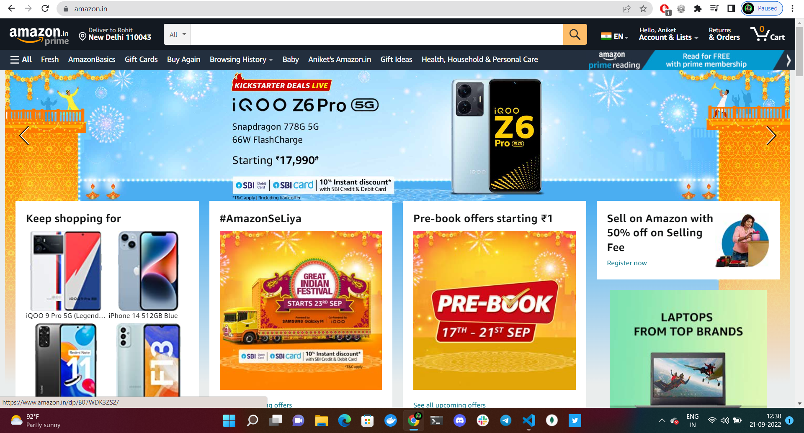

# 100DaysOfCode
Learn Full Stack in just 100 Days

- [100DaysOfCode](#100daysofcode)
  - [Day 1](#day-1)
    - [Git and Github](#git-and-github)
    - [Initialize git repository](#initialize-git-repository)
    - [Git Branch](#git-branch)
    - [Merge branches](#merge-branches)
    - [gitignore](#gitignore)
    - [Github](#github)
  - [Day 4](#day-4)
    - [Let's start CSS.](#lets-start-css)
    - [Versioning of CSS](#versioning-of-css)
    - [Different ways to apply CSS](#different-ways-to-apply-css)
    - [CSS Fonts](#css-fonts)
    - [CSS Colors](#css-colors)
    - [CSS Selectors](#css-selectors)
  - [Day5](#day5)
    - [Some More Selectors](#some-more-selectors)
      - [Universal Selector](#universal-selector)
      - [Attribute Selector](#attribute-selector)
  - [Day 6](#day-6)
    - [CSS Specificity](#css-specificity)
    - [How to calculate specificity](#how-to-calculate-specificity)
  - [Day 7](#day-7)
    - [CSS Border](#css-border)
    - [CSS Box-Model](#css-box-model)
      - [Padding](#padding)
      - [Margin](#margin)
  - [Day 8](#day-8)
    - [Margin Collapsing](#margin-collapsing)
    - [Inline and Block level Elements](#inline-and-block-level-elements)
    - [Display](#display)
    - [Box-Sizing](#box-sizing)
    - [CSS Reset](#css-reset)
    - [CSS Inheritance](#css-inheritance)
  - [Day 9](#day-9)
    - [Text Align](#text-align)
    - [Font Weight and Font Size](#font-weight-and-font-size)
    - [Text Decoration](#text-decoration)
    - [Line height, word spacing and letter spacing](#line-height-word-spacing-and-letter-spacing)
    - [Pseudo classes](#pseudo-classes)
      - [Links](#links)
      - [Input fields](#input-fields)
      - [First child and first of type](#first-child-and-first-of-type)
      - [Last child and last of type](#last-child-and-last-of-type)
  - [Day 16 - JavaScript](#day-16---javascript)
    - [Comments](#comments)
    - [Variables](#variables)
  - [Day 30](#day-30)
    - [First React](#first-react)
    - [First React Practice](#first-react-practice)
    - [Why React? - It's composable](#why-react---its-composable)
    - [Why React? - It's Declarative](#why-react---its-declarative)
    - [JSX](#jsx)
    - [Thought Expeiment](#thought-expeiment)
  - [Day 31](#day-31)
    - [Pop Quiz](#pop-quiz)
    - [Custom Components](#custom-components)
    - [Parent and Child Component](#parent-and-child-component)
    - [Organize Components](#organize-components)
    - [Update on React 18](#update-on-react-18)
    - [Local system setup](#local-system-setup)
  - [Day 32 - React official docs (Quickstart)](#day-32---react-official-docs-quickstart)
    - [Creating and Nesting components](#creating-and-nesting-components)
    - [Writing markup with JSX](#writing-markup-with-jsx)
    - [Adding Styles](#adding-styles)
    - [Displaying Data](#displaying-data)
    - [Conditional Rendering](#conditional-rendering)
    - [Rendering Lists](#rendering-lists)
    - [Responding to events](#responding-to-events)
    - [Updating the screen](#updating-the-screen)
    - [Using Hooks](#using-hooks)
    - [Sharing data between components](#sharing-data-between-components)
  - [Day 33 - Describing the UI](#day-33---describing-the-ui)
  - [Day 40 - Pizza Project](#day-40---pizza-project)
    - [React Router v5.2.0](#react-router-v520)
    - [React Router v6](#react-router-v6)
    - [404 and redirect](#404-and-redirect)
    - [Dynamic routing with param](#dynamic-routing-with-param)
    - [Link and Nav Link Styles](#link-and-nav-link-styles)
    - [Active Link](#active-link)
    - [useSearchParam() Hook and setSearchParams](#usesearchparam-hook-and-setsearchparams)
    - [Navigation on Button Click](#navigation-on-button-click)
  - [Day 41](#day-41)
    - [Nested Routing](#nested-routing)
    - [useLocation() Hook](#uselocation-hook)
    - [Protected Routes](#protected-routes)
    - [Interview Question](#interview-question)
  - [Day 43](#day-43)
    - [React Redux](#react-redux)
  - [Day 50 - MongoDB](#day-50---mongodb)
    - [MongoDB Document](#mongodb-document)
    - [Install MongoDb in your system](#install-mongodb-in-your-system)
    - [MongoDB commands](#mongodb-commands)
    - [Related data in MongoDb](#related-data-in-mongodb)
    - [Operators](#operators)

## Day 1 
### Git and Github
- Download and install git based on your system.
- run the command `git -v`
  - this command shows the current version and verifies that git is installed correctly.
- Setup config file(One time only)
  - `git config --global user.name "Your username"`
  - `git config --global user.email "Your github email"`
    - if you want to change your username and email you should run `git config --global --edit`, which open vim editor and edit your config file and save your changes.
    - Must ensure that your config variables is set correctly
      - `git config --global user.name`
      - `git config --global user.email`

### Initialize git repository
- Step 1: To initialize your git repository you need to run `git init` command.
  - This command place your project under revision control.
  - Create a code file in your project named `sum.js`, etc
     ```sum.js
     var a = 10;
     var b = 20;
     console.log(a+b); 
     ```
- Lets check the status of your git repository 
- To check the status of your git repository run `git status` command
  - git status will return the current state of your git repository
  - <p align="justify"></p>
- Step 2: Add files to staging area
  - `git add <filename>` or
    - Add specific files to your staging area
  - `git add .`
    - Add all files in your staging area
    - <p align="justify"></p>
  - Lets understand how staging area works, Look at the below image
    - <p align="justify"></p>
- Step 3 : Commit your changes
  - Make sure that your changes are saved in your local git repository.
  - `git commit -m "Your changes"` 
    - This command will commit your changes and helps you to understand what has happened.
    - <p align="justify"></p>
  - `git log` will show the order of your commits(commit history) in your git repository.
    - Helps in understanding the state of the current branch by showing the commit that lead to this state.
    - <p align="justify"></p>
- Now lets make some changes in sum.js and create a new file learngithub.js
  - run `git status`
    - sum.js shows modified
    - learngithub.js shows untracked
    - <p align="justify"></p>
  - Commit your changes
  - Now, run `git log`
    - <p align="justify"></p>
  - Now you want to go back in the time where you have only sum.js(initial version)
    - `git checkout` 
      - Used to switch branche. Also works with files and commits.
    - `git checkout <hashCode>`
    - learngithub.js is now deleted and sum.js is restored.
    - <p align="justify"></p>
  - Now, you want your learngithub.js and all the changes you done before back.
    - `git checkout master`

### Git Branch
- Some git branch commands
  - `git branch` at which branch local repo is present.
  - `git branch <branchName>` -> create a new branch
  - `git checkout -b <newBranch>` -> create a new branch and checkout.
  - <p align="justify"></p>
  - Branch Concept
  - <p align="justify"></p>
  - `git branch -a` -> list all remote and local branches
  - `git branch -d <branchName>` -> deletes a branch
- Now, I create a new file named multiply.js in the multiply branch.
  - <p align="justify"></p>
- Branch Map is look like this:
  - master -> dev -> multiply
- Push all the changes to the multiply branch.
- Note: master and dev branches have no idea about the changes in multiply branch.
- <p align="justify"></p>

### Merge branches
- Now, you want your eager branch code get sync with your master branch.
  - `git merge <branch_name>`
    - Integrate the branch together. Combines the changes from one branch to another branch.
    - merge the changes in the staging branch to stable branch.
    - <p align="justify"></p>
    - <p align="justify"></p>
  
### gitignore
- Now, You have some confidential file and you can't share that file on github.
- Use `.gitignore`
  - Not track files/folder that mention in .gitignore file.
  - <p align="justify"></p>
  - <p align="justify"></p>
- Let's create a .gitignore file and secure.txt file, check the status.
- Mention files in .gitignore file
  - <p align="justify"></p>
  - <p align="justify"></p>


### Github
- Host your project.
- On Github
  - Create a repository.
    - <p align="justify"></p>
  - Connect your local repository to github repository.
    - <p align="justify"></p>
  - Push 
    - <p align="justify"></p>
- Now you want to push all of your branches as well.
    - <p align="justify"></p>
- Your Github branch button looks like this
    - <p align="justify"></p>


## Day 4
### Let's start CSS.
- CSS means Cascading Style Sheets.
  - HTML create structure for our website.
  - CSS helps us to make boring webpages to good looking webpages.
  - You can build your website without CSS, but it's impossible to create website wuthout HTML.

- Let's look some popular websites without CSS.
  
  -  [Netflix](https://www.netflix.com/in/) 
     -  With CSS
        -  <p align="justify"></p>
     -  Without CSS
        -  <p align="justify"></p>  
  -  [Google](https://google.com/) 
     -  With CSS
        -  <p align="justify"></p>
     -  Without CSS
        -  <p align="justify"></p>  
  -  [YouTube](https://youtube.com/) 
     -  With CSS
        -  <p align="justify"></p>
     -  Without CSS
        -  <p align="justify"></p>  
  -  [Amazon](https://amazom.com/) 
     -  With CSS
        -  <p align="justify"></p>
     -  Without CSS
        -  <p align="justify"></p>  

  - I use Web Developer Chrome Extension to disable all styles.
  - Now, you understand the importance of CSS.
  - We only spend 5% of our time to write HTML structure and 95% to write CSS.

### Versioning of CSS
- 1996 : CSS1
- 1998 : CSS2
- 1998 : CSS3 (Current Version)
  - We will never get CSS4, because CSS3 updated time to time.
  - Module based.

### Different ways to apply CSS
- First create a index.html file.
 ```html
<!DOCTYPE html>
<html lang="en">
<head>
    <meta charset="UTF-8">
    <meta http-equiv="X-UA-Compatible" content="IE=edge">
    <meta name="viewport" content="width=device-width, initial-scale=1.0">
    <title>Diffrernt ways to apply CSS</title>
</head>
<body>
    
</body>
</html>
 ```
- 1st way (Inline CSS)
- Inside body tag, write some HTML code.
- Use style attribute
```html
<body>
    <h1 style="color: orange;">I am Ashwani</h1>
</body>
```
  
- 2nd way (Internal CSS)
- Use style tag, in the head tag.
```html
<head>
    ...
    <title>Diffrernt ways to apply CSS</title>
    <style>
        h1{
            color: aqua;
        }
    </style>
</head>
```

- 3rd way (External CSS)
- Create new CSS file, write css code in it and link it with HTML in Head tag.
```html
<head>
    ...
    <link rel="stylesheet" href="style.css">
    <title>Diffrernt ways to apply CSS</title>
</head>
```

**Try Out:** Apply all different types of CSS and see the change.

**Note**
- We'll use External CSS.
- Inline CSS has the highest priority, then comes Internal/Embedded followed by External CSS which has the least priority.

### CSS Fonts
```html
<body>
    <h1>I am Ashwani</h1>
    <p>Lorem ipsum dolor sit amet consectetur adipisicing elit. Magnam rerum et nihil consectetur laborum blanditiis,
        consequatur, saepe ratione, nisi id eligendi dignissimos. Nesciunt, corrupti numquam provident quas beatae
        deserunt facilis explicabo quia ducimus tenetur nostrum maxime dolores deleniti dolore ad vel recusandae
        molestias atque dolorum repudiandae sequi ea, saepe exercitationem animi. Qui, aperiam accusamus aut expedita
        neque placeat corrupti illo tempore eius porro recusandae laudantium voluptas at sequi excepturi numquam illum
        ut eligendi rerum accusantium! Vitae rem, ipsa sint modi soluta, harum cumque magni sunt atque inventore autem?
        Autem quia ad illum natus, magnam, accusantium nemo non minus error placeat voluptas dolorem cum suscipit
        perferendis? Architecto dolorem dolor fuga voluptas facilis labore quaerat ab veritatis enim at consequatur
        maiores nihil quia vel, velit assumenda harum placeat odio commodi totam nobis beatae blanditiis. Consectetur
        molestias laborum soluta ut possimus delectus asperiores quod hic a distinctio voluptates qui non exercitationem
        repellat quisquam, corporis optio tempore nulla? Doloribus error magni, dignissimos autem nulla quas mollitia
        ratione cum ad hic itaque sequi est fugiat porro et qui sed doloremque. Aperiam eum distinctio fuga ea unde
        voluptas veritatis pariatur odit totam natus voluptatem, esse quisquam aliquid deserunt laudantium est sequi
        nostrum nulla quasi non dicta.</p>
</body>
```
- By Default, browser font is Serif font.
- In Modern Websites, we use Sans-Serif font.
- Difference between Serif and Sans-serif font.
  
    -  <p align="justify"></p> 
- We want to change the font from serif to sans-serif.
- In style.css
  ```css
  body{
    font-family: Arial, Helvetica, sans-serif;
    /* If Arial is not present, than Helvetica, than sans-serif */
    }
  ```
- Many different types of fonts are available in our Operating System.
- But, some fonts are available only in MacOS, some in Windows.
- To Tackle this problem, we use [google fonts.](https://fonts.google.com/)

- After selecting your font, you get something like this.
- 1st way (In HTML).
  ```html
  <head>
    ...
    <link rel="stylesheet" href="style.css">
    <link rel="preconnect" href="https://fonts.googleapis.com">
    <link rel="preconnect" href="https://fonts.gstatic.com" crossorigin>
    <link href="https://fonts.googleapis.com/css2?family=Roboto:wght@300;400;500;900&display=swap" rel="stylesheet">
    <title>Diffrernt ways to apply CSS</title>
  </head>
    ```

- 2nd way (In CSS).
- Paste @import in the 1st line.
```css
@import url('https://fonts.googleapis.com/css2?family=Roboto:wght@300;400;500;900&display=swap');
```

- You can use any way.
  
- Changes in style.css
  
```css
  body{
    font-family: 'Roboto', sans-serif;
    }
```
- We select 4 different weight types : 300, 400, 500, 900.

- Now, add font-weight and see the difference.

```css
body{
    font-family: 'Roboto', sans-serif;
    font-weight: 900;
}
```

### CSS Colors

- We have 16777216 possible colors.

- RGB
  - rgb(232, 155, 0);
  - R stands for Red (232).
  - G stands for Green (155).
  - B stands for Blue (0).
  - Value from 0 to 255.

 - Hex Code
   - #ff34d8
   - ff for Red.
   - 34 for Green.
   - d8 for Blue.
   - Value from 0 to f.
     - 0, 1, 2, 3, 4, 5, 6, 7, 8, 9, a, b, c, d, e, f

```css
h1{
    background-color: #ff0000;
    color: rgb(255,255,255);
}
```

### CSS Selectors
- index.html file looks like
  ```html
  <body>
    <div>
        <h1>Main Heading</h1>
    </div>

    <div>
        <h2>Sub Heading</h2>
        <p>Lorem, ipsum dolor sit amet consectetur adipisicing elit. Officiis soluta enim ipsum quaerat iusto modi quasi
            natus nam sunt consequatur, expedita pariatur voluptatum dolorem!</p>
    </div>
  </body>
  ```
  - Now, I want to change the 2nd div.
  - If we just use div tag, than the styles apply to all div.
  ```css
  div{
    color: blue;
    background-color: #cdcdcd;
    }
  ```
  - The above selector is called Element Selector.
 - To tackle above problem, we use id and class selector.
 - Now, our HTML looks like this.
  ```html
    <body>
        <div>
            <h1 id="main-heading">Main Heading</h1>
        </div>

        <div>
            <h2 class="sub-heading">Sub Heading</h2>
            <p>Lorem, ipsum dolor sit amet consectetur adipisicing elit. Officiis soluta enim ipsum quaerat iusto modi quasi
                natus nam sunt consequatur, expedita pariatur voluptatum dolorem!</p>
        </div>
    </body>
  ```
  - style.css
  ```css
    #main-heading{
        background-color: #cdcdcd;
        /* id selector */
    }

    .sub-heading{
        /* class selector */
        background-color: #efefef;
    }

    p{
        /* element selector */
        background-color: #6e6767;
    }
  ```
  - You can use same class selector in many times, but you have to use id selector only one time for one element/tag.
  - Most developers use class selector very frequently.

  - **Utility class**
  - Many times we already know, how our webpage will look.
  - Like we already know if h2 text is red and p text is in green.
  - We define, only one property in utility class.

    ```css
    .text-red{
        color: rgb(249, 95, 95);
    }

    .text-green{
        color: rgb(80, 181, 80);
    }

    .bg-color{
        background-color: beige;
    }
    ```
  - Our HTML 
    ```html
    <div>
            <h2 class="sub-heading text-red">Sub Heading</h2>
            <p class="text-green bg-color">Lorem, ipsum dolor sit amet consectetur adipisicing elit. Officiis soluta enim ipsum quaerat iusto modi quasi
                natus nam sunt consequatur, expedita pariatur voluptatum dolorem!</p>
        </div>
    ```
  - We can give more than one class to our tag, like we done in h2 and p tag.

## Day5
### Some More Selectors
  - Here is my HTML
    ```html
    <body>
    <header>
      <p>Inside header</p>
      <h1 class="main-logo">main logo</h1>
      <ul>
          <li><a href="">Home</a></li>
          <li><a href="">About</a></li>
          <li><a href="">Contact</a></li>
      </ul>
      <p>Inside header</p>
    </header>

    <main>
      <h2>Main Content of webpage</h2>
      <section class="my-articles">
          <h2>Articles Section</h2>
          <article>
              <h2>Article Heading</h2>
              <p>Lorem ipsum dolor sit amet. </p>
          </article>
          <article>
              <h2>Article Heading</h2>
              <p>Lorem ipsum dolor sit amet. </p>
          </article>
      </section>
    </main>
    </body>
    ```
#### Universal Selector
  - Now, you want to change the entire text color, you can use **universal selector** .
      ```css
        *{
        color: royalblue;
        }
      ```
    - We not use universal selector like this and not so much, we use this to reset our CSS.
  - Here is my CSS
  
  ```css
      header{
      background-color: #ffebeb;
  }

  /* Select section which has my-articles class */
  section.my-articles{
      background-color: #ffefef;
  }

  /* Select all p tag inside header tag */
  /* Descendent Selector */
  /* We use mostly */
  header p{
      color: red;
  }

  /* change the color of all links inside list */
  li a{
      color: rgb(0, 70, 0);
  }

  /* Selects all h2 inside section tag which has my-articles class */
  /* section.my-articles h2{
      color: purple;
  } */

  /* But, I want to select only Direct child (h2) of section  */
  section.my-articles > h2 {
    color: purple;
  }

  /* Selects direct p who come after h2 */
  h2+p{
      color: rosybrown;
  }
  ```
#### Attribute Selector
   - Here is my HTML
     ```html
      <body>
        <h2>Links</h2>
        <a href="https://google.com">Google</a><br>
        <a href="https://amazon.com">Amazon</a><br>
        <a href="https://amazon.in">Amazon India</a><br>
        <a href="youtube.com">YouTube</a><br>

        <h2>Form</h2>
        <form>
          <label for="fname">First Name:</label><br>
          <input type="text" id="fname"><br>
          <label for="lname">Last Name:</label><br>
          <input type="text" id="lname"><br>
          <label for="pass">Password:</label><br>
          <input type="password" id="pass"><br><br>
          <input type="button" value="Submit">
        </form>
      </body>
      ```
   - href, type etc are attribute of their respective elements.
   - CSS file
      ```css
      input[type = "text"]{
          color: red;
      }

      input[type="password"]{
          background-color: antiquewhite;
      }

      /* Now, I want to select link that havve amazon */

      a[href *= "amazon"]{
          color: brown;
      }

      /* Now, I want to Select those link that start with https */
      a[href ^= "https"]{
          color: bisque;
      }

      /* Now, I want to Select those a that ends with .in */
      a[href $= ".in"]{
          color: rebeccapurple;
      }
      ```
## Day 6
### CSS Specificity
- class selector have more prefrence than elements/tags selector, because classes are more specific than HTML elements.
- ID selector have more prefrence than class selector.
- Inline style attribute have more prefrence than ID selector.
  ```imp
    Inline style attribute > ID selector > class selector > element selector
  ```
- Here is my HTML
   ```html
  <body>
    <h1 class="myClass" id="myId" style="color: brown;" >Hello</h1>
  </body>
  ```
 
- Here is my CSS.  
  ```css
      h1{
        color: green;
      }

    .myClass{
        color: red;

      }

      #myId{
        color : blue;
      }
  ```
- If you want to apply ID (forcefully), you can do this.
  ```css
  #myId{
    color : blue !important;
  }
  ```
  - But, its not a good practice.
- HTML
  ```html
  <body>
    <h1 class="myClass heading">Hello</h1>
  </body>
  ```
- CSS
  ```css
    h1{
      color: green;
  }

  .myClass{
      color: red;

  }

  h1.heading{
      color: magenta;
  }
  ```
  - Now, we have two classes on an element, class write after than other class have more specificity.
  - Eg : heading has more specificity than myClass, if myClass comes after heading class than text have red color.
- Here is my updated CSS.
  ```css
    h1.heading{
        color: magenta;
    }
    .myClass{
        color: red;
    }

  ```
  - h1.heading has more specifity.
  
### How to calculate specificity
- Look this picture carefully.
-  <p align="justify"></p>
-  Here is my HTML.
  ```html
  <body>
  <div id="container">
    <ul class="my-style">
        <li class="fav">The Big Short</li>
        <li>Margin Call</li>
        <li>Wolf of wallstreet</li>
        <li>Wall Street : Money never sleeps</li>
    </ul>
  </div>
  </body>
  ```
- CSS
  ```css
  div#container ul.my-style li{
    color: blue;
    background: bisque;
    }

      /* Inline > ID > Class > Element */
      /* 0, 1, 1, 3 */
      /* 0 -> Inline
      1 -> ID 
      1 -> Class
      3 -> Element 
      for easy understanding, we say above style have 113 specificity */
  li.fav{
          color: bisque;
          background: blue;
      }

      /* 0, 0, 1, 1  --> 11 */
  ```
  - li.fav style not apply, because it has low specificity than above style.
  
## Day 7
### CSS Border
- Here is my HTML (himHTML shortform)
  ```html
    <body>
    <div class="header">
      <ul>
        <li class="home">Home</li>
        <li>About</li>
      </ul>
    </div>

    <h2>Our Heading</h2>

    

    <p>This <span>is</span> paragraph</p>
  </body>
  ```
- Now, I want to add border arround my HTML elements.
- I can achieve this via border property of CSS.
- Here is my CSS (himCSS shortform).
  ```css
  h2, img{
      border: 5px solid red;
       /* 5px-> width of border, border style -> solid, border color -> red */
       /* This is shorthand*/
  }
  ```
- We can also use this.
- h2 takes full width, because h2 is a block level element.
  ```css
    border-width: 5px;
    border-style: solid;
    border-color: red;
  ```
- Now, I want to apply border only on top and bottom of HTML tag.
  ```css
    border-bottom: 5px solid red;
    border-top: 5px solid red;
  ```
- Our border corners are very sharp, we can round that.
  ```css
    border: 5px solid red;
    border-radius: 5px;
  ```
### CSS Box-Model
#### Padding
- <p align="justify"></p>
- As you saw above, there is no space between Our content(h2) and border.
- We can add space with the help of padding property.
  ```css
    h2{
      border: 5px solid red;
      padding-left: 40px;
      padding-bottom: 40px;
      padding-right: 40px;
      padding-top: 40px;
    }
  ```
- The shorthand, Now, you want equal padding in every side
  ```css
   padding: 40px;
  ```
  -  add 20px in top, bottom and 40px in left,right  
  ```css
  padding: 20px 40px;
  ```
  -  Different padding in every sides.
  - Clockwise Direction -> Top, Right, Bottom, Left 
  ```css
  padding: 10px 20px 30px 40px;
  ```

#### Margin
-  Used to create space around elements, outside of any defined borders.
-  Everything same as padding, all shorthands etc.
-  Now, As you see the output, I want to reduce the width.
  ```css
  width: 500px;
  ```
- Now, I want my element in center.
  ```css
  margin: 20px auto;
  ```
- Our Background start from border edge.
  ```css
    border: 5px dotted red;
    background: lightblue;
  ```

## Day 8
### Margin Collapsing
- himHTML
  ```html
  <body>
    <div class="box1">
      <h2>this is box 1</h2>
      <p>Lorem ipsum dolor sit amet consectetur adipisicing elit. Incidunt earum provident debitis eaque accusamus illum nihil nam voluptatum! Praesentium, tenetur!</p>
      
    </div>
    <div class="box2">
      <h2>this is box 2</h2>
      <p>Lorem ipsum dolor sit amet consectetur adipisicing elit. Incidunt earum provident debitis eaque accusamus illum nihil nam voluptatum! Praesentium, tenetur!</p>
    </div>
  </body>
  ```
- himCSS
  ```css
  .box1, .box2{
    border: 2px solid black;
    padding: 10px;
  }

  .box1{
      margin-bottom: 40px;
  }

  .box2{
      margin-top: 50px;
  }
  ```
  - What you think the total margin between box1 and box2?
  - It's 50px, not 90px(40 + 50).
  
### Inline and Block level Elements
- There are 3 types of elements
  - Block elements
    - A block-level element always starts on a new line and takes up the full width available (stretches out to the left and right as far as it can).
    - If you give custom width and height, element take it.
    - Some block elements are
      - div, heading(1-6), p, ul, li, form, article, aside, main, nav etc
      - [Complete List](https://developer.mozilla.org/en-US/docs/Web/HTML/Block-level_elements)
  - Inline elements
    - An inline element does not start on a new line and only takes up as much width as necessary.
    - If you provide custom height and width, nothing change.
    - Only left and right margins are available, if you provide other margin, element ignore that.
    - If you provide padding for top and bottom, everything messed up, so, use only left and right padding.
    - img tag is exception, you can use width, height, margin, padding.
    - Some Inline elements are
      - a, img, input, label, span, textarea
      - [Complete list](https://developer.mozilla.org/en-US/docs/Web/HTML/Inline_elements)
  - Inline Block elements
    - As you saw above, we can't use full potential of margin, padding, width etc in inline elements.
    - To tackle this problem, we set display property as inline-block, this gives us full controls over the element.


### Display 
- If you want to convert a block element to inline element, you can use display property.
- From Block to inline
  ```css
  display: inline;
  ```
- From Inline to block
  ```css
  display: block;
  ```

### Box-Sizing
- himHTML
  ```html
  <body>
    <hr>
    <div class="box1">
      <h2>Heading</h2>
      <p>Lorem ipsum dolor sit amet consectetur adipisicing elit. Itaque praesentium neque, dignissimos illum voluptas totam nam cupiditate debitis architecto eius fugiat perspiciatis quia cumque exercitationem nesciunt est dicta. Rerum consequatur dicta voluptatum, vero molestias sit eveniet omnis necessitatibus magnam harum doloribus id laborum deserunt tenetur sequi, fugit autem exercitationem veritatis! Dolore aliquam animi hic, sapiente voluptate reiciendis doloribus iure eum, eveniet necessitatibus accusantium ad, voluptates nemo suscipit exercitationem accusamus sint atque? Maiores natus voluptatibus dolor quaerat vero odio saepe perspiciatis hic. Dolorem quasi et pariatur maxime illum voluptates natus, harum magni ea! Maxime atque magnam cumque tenetur illo suscipit aperiam.</p>
      
      </div>
  </body>
  ```
- himCSS
  ```css
  hr{
    border: 0.5px dashed black;
    width: 500px;
    margin-left: 0px;
  }

  .box1{
      width: 500px;
      border: 10px solid red;
      background: lightsalmon;
      padding: 50px;
  }
  ```
    - The output of above code, hr represents 500px width, and the box1 size is also 500px but due to border and padding it extends from 500px
    - We have to fix this issue.
    - 
  - We can use box-sizing property
    - By default it is content-box.
   ```css
    box-sizing: border-box;
   ```
  - The output is
  - 

### CSS Reset
- Use Box-Sizing's HTML, as you see there are some default margin, padding are present in your tags.
- We don't want default browser styling.
  ```css
    *{
      margin: 0px;
      padding: 0px;
      box-sizing: border-box;
    }
  ```
    - We also reset box-sizing to border-box, so we can't mess up when writing CSS.
- It's good practice to reset CSS, before start writing CSS.

### CSS Inheritance
- himHTML
  ```html
  <body>
    <a href="#">My Store</a>
    <h1>Welcome to My Website</h1>
    <div class="container1">
      <h2>My Blog 1</h2>
      <p>Lorem ipsum dolor sit amet consectetur adipisicing elit. Placeat, fuga?</p>
    </div>
    <div class="container2">
      <h2>My Blog 1</h2>
      <p>Lorem ipsum dolor sit amet consectetur adipisicing elit. Placeat, fuga?</p>
    </div>
  </body>
  ```

- As you can see, all text is black color and now, i want to change.
- So, I just provide body{color: orange;}, and all the tags got orange color.
- All tags, inherites property color : orange.
- If you want, to change the specific tag style, you can easily achieve that.
- But, the a tag doesn't inherites color : orange, why..? 
- Because, The default Style by Browser.
- You can see browser style in computed tab.
- If want to change a tag style, you can done that with element selector.
- himCSS.
  ```css
  body{
    color: orange;
  }

  .container1{
      color: red;
  }

  .container2{
      color: hotpink;
  }

  a{
      color: burlywood;
      text-decoration: none;
  }
  ```

## Day 9
### Text Align
- himHTML
  ```html
  <body>
    <a href="#">My Store</a>
    <h1>Welcome to My Website</h1>
  </body> 
  ```
- Now, I want to put the h1 text in the middle of screen.
- As you know h1 is a block element, that takes width as much as possible.
- To achieve this, I use text-align property.
- Now, I want to do the same for a tag also that is inline element.
- If I gave text-align property nothing changes.
- himCSS
  ```css
  h1{
    background: lightgray;
    text-align: center;
  }

  a{
      text-align: center;
      display: inline-block;
      width: 500px;
      text-align: center;
      background: lightcoral;
  }
  ```
### Font Weight and Font Size
- Sometimes you have to show something on bold and sometimes thin(depends on requirement).
- We use font-weight property to add boldness/thin in our font.
- In many fonts 400 is normal but not for all(It depends on font to font).
- himCSS
  ```css
  h1{
    font-weight: 900;
    font-style: italic;
    font-size: 20px;
  }
  ```
- font-style for different style of font like italic, normal etc.
- If you want to change the size of font, you can use font-size property.

### Text Decoration
- As you saw earlier, in our a tag there is a underline present.
- If you don't want that line, you can use text-decoration : none.
- But if we you want to add a line than you can use text-decoration property.
  ```css
   text-decoration: underline solid red;
  ```
- We can use different line types like : underline, overline, line-through and solid/dotted/wavy etc

### Line height, word spacing and letter spacing
- If you want to change space between two words, you can use word-spacing property.
- If you want to change space between two letters, you can use letter-spacing property.
- If you want to change space between two lines, you can use line-height property.
  ```css      
    p{
        line-height: 35px;
        word-spacing: 10px;
        letter-spacing: 5px;
    }
  ```

### Pseudo classes
#### Links
- We use pseudo classes to define special state of an element.
- What is state means?
- himHTML
  ```html
  <body>
    <a href="https://twitter.com/eagerashwani/">My Twitter</a>
    <a href="https://github.com/eagerashwani/100DaysOfCode">My Github</a>
  </body>
  ```
- You can see both links are blue in color.
- Lets click on any link suppose github. After visiting the github, back to himHTML page.
- Now, your Github color is changed from blue to purple.
- How browser knows that the particular link is visited? Browser store this information in cache.
- This is a visited state.
- Hover State : Till My mouse points on the link. 
- Now, I want to style my link, when i hover over it.
- Some other pseudo classes : link, active.
- himCSS
  ```css
  a:link{
    color: orange;
  }

  a:visited{
      color: red;
  }

  a:hover{
      color: green;
  }

  a:active{
      color: blueviolet;
  }
  ```
  - Note : Please follow the above order(recommended).

#### Input fields
-himHTML
 ```html
  <body>
    <form>
      <input type="email" name="" id="" placeholder="Enter email" required> <br><br>
      <input type="password" name="" id="" placeholder="Enter password"> <br> <br>
      <input type="submit" value="Sign in">
    </form>
  </body>
 ```

- himCSS
  ```css
  input:focus{
    color: red;
    outline: none;
    border: 2px solid gold;
    padding: 5px;
  }

  input:required{
      color: green;
  }
  ```
- We mainly use focus and required pseudo classes in input fields.
- For more [visit](https://developer.mozilla.org/en-US/docs/Web/CSS/Pseudo-classes)

#### First child and first of type
- To understand this, first you have to know about parent-child relation.
  - Which element is parent and who there child, vice-versa.
- himHTML
  ```html
  <body>
    <header>
      <p>I am inside header first child</p>
      <p>I am inside header second child</p>
      <p>I am inside header third child</p>
      <h4>I am last child of header</h4>
    </header>

    <p>I am body first para </p>
    <p>I am body second para </p>
    
    <div class="container">
      <p>I am inside container first</p>
      <p>I am inside container second</p>
      <p>I am inside container third</p>
    </div>
  </body>
  ```
- himCSS
  ```css
  /* Is <p> is the first child of its parent */
    p:first-child{
        color: red;
    }
  ```
- himCSS
  ```css
  /* Is <p> is the first child of its parent */
    p:first-child{
        color: red;
    }
  ```
- himCSS
  ```css
  /* Is <p> is the first child of its parent */
    p:first-child{
        color: red;
    }
  ```
  - Apply red color to those p tag who is the first child of its parent like header and div tag in above example.
  
- Now check first-of-type
- himCSS
  ```css
  p:first-of-type{
    color: brown;
  }
  ```
  - Apply brown color to the first appeared child of parent.
  - Or you can say, Who is the first p tag of parent. 
  - In the above html, I am body first para is the first appeared child of body tag.
    - I know, I don't write it well, Hope you understand.


#### Last child and last of type
- same as first child and first of type except they change last instead of first.
- To understand easily
  - last/first-of-type : start with parent like header tag first/last p tag
  - first/last-child : start with child like Is this p tag is the first/last element of its parent.

- himCSS
  ```css
    p:last-child{
        color: green;
    }
  ```

- himCSS
  ```css
  p:last-of-type{
    color: red;
  }
  ```

## Day 16 - JavaScript
### Comments 
```js
// console.log() - Is used to print, what inside the ()
// we can also use '' and `` instead of ""
// we use `` in string templates
// ; is not mandatory but its good for practice
// you already know how to add comments in javascript
// you can use ctrl + / to comment a line and same for undo the comment
console.log("Hello world");
```
### Variables
```js
"use strict";
//Variables

// Is used to store the information
// use that information later
// we can also change the information later
// Variables is CaseSensitive


// declare a variable --------------------------------
var firstName = "Ashwani";

// use a variable ---------------------------------
console.log(firstName);

// change value -----------------------------------
// no need to use var keyword again
firstName = "Eager"

console.log(firstName)

// if we remove var keyword from line 10, still everything works!
// this may raise problem 
// if by mistake you wrote firstname instead of firstName in line 17
// this create two different variables
// we don't want two different variables
// so, to tackle this problem we use "use-strict"
// JS is loosely typed lang, and we don't want to declare a variable without
// var keyword. use-strict help in that type of problem, and give error if
// we make that type of mistake.
```
```js
```
```js
```
```js
```
```js
```
```js
```
```js
```
```js
```
```js
```
```js
```
```js
```
```js
```
```js
```
```js
```
```js
```
```js
```
```js
```
```js
```
```js
```
```js
```
```js
```
```js
```
```js
```
```js
```
```js
```
```js
```
```js
```
```js
```
```js
```
```js
```
```js
```
```js
```
```js
```
```js
```
```js
```
```js
```
```js
```
```js
```
```js
```
```js
```
```js
```
```js
```
```js
```
```js
```
```js
```
```js
```
```js
```
```js
```
```js
```
```js
```
```js
```
```js
```
```js
```
```js
```
```js
```
```js
```
```js
```
```js
```
```js
```
```js
```
```js
```
```js
```
```js
```
```js
```
```js
```
```js
```
```js
```
```js
```
```js
```
```js
```
```js
```
```js
```
```js
```
```js
```
```js
```
```js
```
```js
```
```js
```
```js
```
```js
```
```js
```
```js
```
```js
```
```js
```
```js
```
```js
```
```js
```
```js
```
```js
```


## Day 30
### First React
- Lets setup React CDN for our first app
- Add below lines in your .html file in the head tag.
  ```html 
    <script crossorigin src="https://unpkg.com/react@18/umd/react.development.js"></script>
    <script crossorigin src="https://unpkg.com/react-dom@18/umd/react-dom.development.js"></script>
    <script src="https://unpkg.com/@babel/standalone/babel.min.js"></script>
  ```
- Add below line in the body tag
  ```html
  <script src="hello.js" type="text/babel"></script>
  ```
- Now, we can call ReactDOM.render() provided by react-dom.development libraray in our JS file
- ReactDOM.render() takes two input, first is the html part(What is going to render) and second is where render.
   ```js
   ReactDOM.render(<h1>Hello React</h1>, document.getElementById("root"));
   ```
- Lets give root id to html element
  ```html
  <div id="root"></div>
  ```

### First React Practice
- Try to write that 1 linear of React code again! This time, see if you can figure out how to render an <ul> with 2+ <li>s inside
  ```js
  ReactDOM.render(<ul><li>Hello 1</li><li>Hello 2</li></ul>, document.getElementById("root"));
  ```
### Why React? - It's composable
- We can make components and put together that build a website.
- This helps to make our code more maintainable and flexible.
- Challenge : Create your custom component call it MainContent
  ```js
  const MainContent = (){
    return (
    <h1>I am learning React</h1>
    )
  }
  ReactDOM.render(
    <div>
      <MainContent />
    </div>, document.getElementById("root));
  ```
### Why React? - It's Declarative
- Just tell me what to do, and I'll worry about how I get it done.

### JSX
- JSX stands for JavaScript XML. JSX allows us to write HTML in React.
  ```js
  const element = <h1 className="header">I am learning react </h1>
  console.log(element);
  // { $$typeof: Symbol(react.element), type: 'h1', key: null, ref: null, 
  // props: {className: 'header', children: 'I am learning react '}
  // ref: null
  // type: "h1"
  // _owner
  // : 
  // null … }

  ReactDOM.render(element, document.getElementById("root"));
  ```
- JSX return plain JS object.
- We have to return only single parent element(We can't give multiple lines of html code in render function).
- If you still need more elements than wrap up your html inside div element or <></>.
  ```js
  ReactDOM.render( <div>
      <h1 className="header">I am learning react </h1>
      <h1 >I am learning stock market </h1>
     </div>, document.getElementById("root"));
  ```
- We can also put html in variable.
  ```js
  const page = (
  <div>
      <h1 className="header">I am learning react </h1>
      <h1 >I am learning stock market </h1>
  </div>
  );

  ReactDOM.render(page, document.getElementById("root"));
  ```
- Challenge : 
  ```js
  const navbar = (
    <nav>
        <h1>Ashwani Kumar</h1>
        <ul>
          <li>Pricing</li>
          <li>About</li>
          <li>Contact</li>
        </ul>
    </nav>
  );

  ReactDOM.render(navbar, document.getElementById("root"));
  ```
### Thought Expeiment
```js
const page = (
    <div>
        <h1>H1</h1>
        <h1>H1 again</h1>
        <h1>H1 again x2</h1>
        <h1>H1 again x2 return</h1>
    </div>
)

document.getElementById("root").append(JSON.stringify(page))
// above line prints the object in the browser. Why..?? 
// Because JSX return plain object
// ReactDOM.render renders this object as real element that browser can understand

// Comment .append() line and uncomment below line and you see you element
// ReactDOM.render(page, document.getElementById("root"))
```
## Day 31
### Pop Quiz
- 1. Why do we need to `import React from "react"` in our files?
- React is what defines JSX

- 2. If I were to console.log(page) in index.js, what would show up?
- A JS object. React elements that describe what react should eventually add to the DOM for us.
- 3. Can we put multiple html elements in page?
- We need our JSX to be nested under a single parent element.
- 4. What does it mean for something to be "declarative" instead of "imperative"
- Declarative means I can tell the computer WHAT to do and expect it to handle the details. Imperative means I need to tell it HOW to do each step.
- 5. What does it mean for something to be "composable"?
- We have small pieces that we can put together to make something larger than the individual pieces.

### Custom Components
- What is react component?
  - Function that returns react element (UI).
- Creating variable like page is good enough but its not recommended.
- React adopts the concept of having a function that allows us to create user interface or create elements over and over again if we wanted to.
  ```js
  function whyReact(){
    return (
        <div>
            <ol>
                <li>It is composable</li>
                <li>It is declarative</li>
                <li>Easy and Fast</li>
            </ol>
        </div>
        )
    }

    ReactDOM.render(whyReact(), document.getElementById("root"))
  ```
- We have to follow some conventions 
  - Use PascalCase instead of camelCase
  - Instead of () we have to use < /> with our function component
  ```js
    ReactDOM.render(<WhyReact/>, document.getElementById("root"))
  ```
- Lets create a component having header,nav, ol, footer etc.
  ```js      
    function MyComponent(){
      return (
            <div>
                <header>
                    <nav>
                           
                    </nav>
                </header>
        
                <h1>Reasons I'm Excited learn React</h1>
                <ol>
                    <li>Job Demand</li>
                    <li>Easy to understand</li>
                    <li>Fast rendering</li>
                    <li>Single Page Application</li>
                </ol>
        
                <footer>
                    &#169; 2022 Kumar Development. All rights reserved.
                </footer>
            </div>
        );
    } 

    ReactDOM.render(<MyComponent />, document.getElementById("root"));

  ```
  - If we build our app like above code, than why we use react
  - Its monolithic approach.
  - We have to build components and bring them together.

### Parent and Child Component
```js
    function Header(){
        return (
            <header>
                <nav>
                     
                </nav>
            </header>
        );
    }

    function MainContent(){
        return (
            <>
            <h1>Reasons I'm Excited learn React</h1>
            <ol>
                <li>Job Demand</li>
                <li>Easy to understand</li>
                <li>Fast rendering</li>
                <li>Single Page Application</li>
            </ol>
            </>
        );
    }

    function Footer(){
        return (
            <footer>
              &#169; 2022 Kumar Development. All rights reserved.
            </footer>
        );
    }

    function MyComponent(){
      return (
            <div>
              <Header />
              <MainContent />
              <Footer />
            </div>
        );
    } 

    ReactDOM.render(<MyComponent />, document.getElementById("root"));
```
 - MyComponent is Parent Component and Header, MainContent and Footer is child component.
 - Let's add some styling 
   ```js
   function Header(){
        return (
            <header>
                <nav>
                     
                    <ul className="nav-items">
                        <li>Pricing</li>
                        <li>About</li>
                        <li>Contact</li>
                    </ul>

                </nav>
            </header>
        );
    }
   ```

  ```css
  .nav-items{
    list-style: none;
    display: flex;
    justify-content: space-around;  
    align-items: center;  
    }

  ```
### Organize Components
- Now, Lets organize the components 
- Make Header.js, always follow PascalCase for files that have jsx code
- Paste the Header function code
- Now to import Header(), we have to export it
- And import in index.js or main file
```js
export default function Header(){
    return (
        <header>
            <nav>
                 
                <ul className="nav-items">
                    <li>Pricing</li>
                    <li>About</li>
                    <li>Contact</li>
                </ul>

            </nav>
        </header>
    );
}
```
```js
import Header from "./Header";
```
- Do same for Footer and MainContent
  
### Update on React 18
- ReactDOM.render() is not supported in React 18
- instead of import ReactDOM from "react-dom", use import ReactDOM from "react-dom/client"
- instead of ReactDOM.render(page, documentElementById("root")), use
  ```js
  const root = ReactDOM.createRoot(documentElementById("root"))
  root.render(page);
  ```

### Local system setup
- Install node
- Check node and npm installed successfully
- Standard Way
  - Create react app
    - npx create-react-app <projectname>
    - cd <projectname>
    - npm start
- With Vite
  - npm create vite@latest
  - cd <projectname>
  - npm install
  - npm run dev

## Day 32 - React official docs (Quickstart)
- For, Now we are going to follow official react docs.

### Creating and Nesting components
- React apps are made up of `components`. A component is the pieace of UI that has its own logic and appearance. Everything in the UI is component eg : Button, section, even text can be a component.
- React components are JS functions that returns Markup
  ```js
    function MyButton(){
      return (
        <button> Who Am I? </button>
      );
    }
  ```
- Lets Nest MyButton into another component
  ```js
  export default function App(){
    return (
      <>
        <h1> I am Heading </h1>
        <MyButton/>
      </h1>
    );
  }
  ```
- React components are always start with capital letter while HTML tags with small letter.

### Writing markup with JSX
- Above markup syntax is JSX.
- JSX is stricter than HTML.
- All components and tags must be wrap up with single parent(<></> or div).
- <></> is called fragment.
  
### Adding Styles
- You can specify CSS class with `className`. It works same as HTML class tag.
  ```js
    <h1 className="textMe"> I am Heading </h1>
  ```
  ```css
    .textMe{
      font-size : 80px;
    }
  ```
- You can import CSS file like this
  > import './App.css';

### Displaying Data
- JSX helps you put markup inside JS.
- You can embed JS variable from your code and display it.
  ```jsx
    return (
      <h1>
        {user.name}
      </h1>
    );
  ```
- Look the below example 
  ```jsx
    function DisplayingData(){
      const user = {
        name : 'Ashwani Kumar',
        imgUrl : 'https://i.imgur.com/yXOvdOSs.jpg',
        imgSize : 120
      }
      return (
        <>
          <h1>{user.name}</h1>
          
        </>

      );
    }
  ```
- style use two {{}}, outer {} is for style attribute and inner one is for JSX.

### Conditional Rendering
- Use JS conditions eg: if else
  ```jsx
  let content;
  if(isLoggedIn){
    content = <AdminPanel />
  } else {
    content = <LoginForm/>
  }

  return (
    <div>
      {content}
    </div>
  );
  ```
- You can also use ternary operator
  ```jsx
  <div>
   {isLoggedIn ? (<AdminPanel />) : (<LoginForm />)}
  </div>
  ```
- If you don't need `else`, use logical && syntax.
  ```jsx
  <div>
    {isLoggedIn && <AdminPanel />}
  </div>
  ```
### Rendering Lists
- We can use for loop or map() to render list.
- lets take some products in an array. Eg:
  ```js
      const products = [
        { name : 'Apple Pencil', id : 1},
        { name : 'iphone 14', id : 2},
        { name : 'ipad Pro M2', id : 3},
        { name : 'Apple Watch Ultra', id : 4},
      ]
  ```
- Lets transform array of products into array of list
  ```jsx
  const listitems = products.map(product => {
    return <li key={product.id}>
      {product.name}
    </li>
  });

  return(
    <>
      {listitems}
    </>
  )
  ```
  - li has key(string or number) attribute, it uniquely identifies that item along ites siblings  
  - React need this keys to understand what happens later, if you insert, delete or reorder the items.\
  
### Responding to events
- You can respond to events by declaring `event handlers` functions inside your component.
  ```js
  function MyButton(){
    function handleClick(){
      alert('You clicked me');
    }

    return (
      <button onClick={handleClick}> Click me </button>
    );
  }
  ```
  - `onClick = {handleClick}` has no parantheses.
  - React will call your event handler when the user clicks on button.
  
### Updating the screen
- Sometimes, you want your component to remenber some information and display it. Eg: No of times button clicked.
- To achieve this, add `state` to your component.
- First, import
    > import {useState} from 'react';
- Now, declare a state variable inside your component.
  ```js
  function UpdateState(){
    const [count, setCount] = useState(0);
  }
  ```
  - useState gives two things:
    - the current state (count)
    - the function that lets you update it (setCount)
    - Always follow this convention `[something, setSomething]`
    - First time the button displayed, count will be 0, because we pass 0 to useState().
    - When you want to change the state, call setCount() and pass the new value to it.
   ```jsx
   function MyUpdateState(){
    const [count, setCount] = useState(0);

    function handleClick(){
      setCount(count + 1);
    }

    return (
      <button onClick={handleClick}> My press count is {count}</button>
    )
   }
   ```
   - React will call your function again and again like 1,2 and so on.
   - If we render same component multiple times, each will get its own state and doesn't effect other buttons state.


### Using Hooks
- Functions starting with `use` are called Hooks. useState is a built-in Hook.
- We can write our own Hooks by combining the existing ones.
- You can only call Hooks `at top level` of your components.

### Sharing data between components
- In useState, we can see MyButton had its own independent `count` and when each button was clicked, only the `count` for the button clicked changed.
- Sometimes we needd components to <i> share data and always update together.</i>
- To make same count and update together, we have to move the state from individual buttons upwards to closet component containing all of them.
  - Move the state from MyUpdateState to App
  - Then, <i>pass the state down</i> from App to each Button, together with the shared click handler.
    ```jsx
    export default function MyApp() {
        const [count, setCount] = useState(0);

        function handleClick() {
          setCount(count + 1);
        }

        return (
          <div>
            <h1>Counters that update together</h1>
            <MyButton count={count} onClick={handleClick} />
            <MyButton count={count} onClick={handleClick} />
          </div>
        );
      }
    ```
  - The information you pass down like this is called `props`.
  - To read the props you have passed from its parent component. 
    ```jsx
    function MyButton({ count, onClick }) {
        return (
          <button onClick={onClick}>
            Clicked {count} times
          </button>
        );
     }
    ``` 
## Day 33 - Describing the UI
- 


## Day 40 - Pizza Project
### React Router v5.2.0
- First install react router in your project
  ```bash
  npm i react-router-dom
  ```
  - In this project, we are going to use version 5.2.0
    ```bash
    npm install react-router-dom@5.2.0
    ```
  
- Lets import BrowserRouter, Switch, Route from react-router-dom in App.js
    ```bash
    import { BrowserRouter as Router, Switch, Route} from 'react-router-dom';
    ```
    - BrowserRouter as Router means, we're aliasing the BrowserRouter 
    - We can use Router in our project instead of BrowserRouter.
- Lets create some components
  - Use react snipets `rafce`, `rfc`, `rafc`.
- In App.js
  ```js
    <>
      <Router>
        <Switch>
          <Route path="/" component={Home}>Home</Route>
          <Route path="/about" component={About}>About</Route>
        </Switch>
      </Router>
    </>
  ```
  - When we add /about in our browser still Home component shows.
    - Why?
      - Whenever react get / in browser url it renders the Home component 
    - If we remove `Switch` than the browser shows both components.
      - Why?
        - After getting / react still continues to find the matching components
        - And shows all components start with /
    - You have to use `exact` in Route of Home component
      ```js
      <Route path="/" component={Home} exact>Home</Route>
      ```
- Lets add simple nav
  ```js
   <Router>
        <a href="/">Home</a>
        <a href="/about">About</a>
        <Switch>
  ```
  - Everytime we click on Home and About, our browser reload the page, so what's the use of react?
  - To tackle this problem, use <Link>, import from react-router-dom.
 
### React Router v6
- In v6
- `import { BrowserRouter as Router, Routes, Route, Link} from 'react-router-dom';`
  ```js
  <Router>
        <Link to="/">Home</Link>
        <Link to="/about">About</Link>
        <br/>
        
        <Routes>
          <Route path="/" element={<Home />}></Route>
          <Route path="about" element={<About />}></Route>
        </Routes>
  </Router>
  ```
- Lets create a new component for router named navbar and put above code inside it.
  ```js
  const NavBar = () => {
  return (
    <>
    <ul>
        <li><Link to="/">Home</Link></li>
        <li><Link to="about">About</Link></li>
    </ul>
    </>
  )
  }
  ```
- If you want to use navigation anywhere in your app
- `<Link to="/about">Go to About</Link>` use like this

### 404 and redirect
- Create a new component, and in App.js
 ```js
     <Routes>
          <Route path="/" element={<Home />}></Route>
          <Route path="about" element={<About />}></Route>
          <Route path="*" element={<Page404 />}></Route>
    </Routes>
 ```
 - * means, if all paths that mentioned above is not found than load Page404 component.
- To redirect, first import Navigate from react-router-dom
  ` <Route path="*" element={<Navigate to="/" />} />`
  - In the element give Navigate with to and give the path, where you want to redirect.

### Dynamic routing with param
- Suppose you have a list of users and you have to show particular user profile and url change based on username.
- Why Its important?
  - Suppose we have 1000s of users, we don't make 1000s Route url instead we use dynamic routing with params.
- Lets create a new component
  ```js
  import { useParams } from "react-router-dom";

    const User = () => {
        const params = useParams();
        const {name} = params;
        return (
            <>
                <h1>I am {name}'s page </h1>
            </>
        );
    }

    export default User;
  ```
  - With the help of useParamas(), you can get data from urls.
- In App.js
  ```js
  <Route path='user/:name' element={<User/>} />
  ```
- Lets create their Link
  ```js
  <Link to="user/anil">Anil</Link>
  <Link to="user/ashwani">Ashwani</Link>
  ```
- You can pass multiple params.
  ```js
  <Route path='page/:name/:id' element={<Page404/>} />
  ```

### Link and Nav Link Styles
- Lets add some styles to our navbar
  ```css
  .navbar{
  text-align: right;
  }

  .navbar li{
    display: inline-block;
    padding: 10px 5px;
  }

  .nav-bar-link{
  color: black;
  text-decoration: none;
  }

  .nav-bar-link:hover{
    color: orange;
  }

  ```
- We cant apply style to Link tag, so instead of Link tag we use NavLink tag
  ```js
    <ul className='navbar'>
        <li><NavLink className='nav-bar-link' style={{color:'red'}} to="/">Home</NavLink></li>
        <li><NavLink className='nav-bar-link' to="about">About</NavLink></li>
        <li><NavLink className='nav-bar-link' to="user/anil">Anil</NavLink></li>
        <li><NavLink className='nav-bar-link' to="user/ashwani">Ashwani</NavLink></li>
    </ul>
  ```

### Active Link
- We can simply use .active class
  ```css
  .navbar .active{
    color:  green;
  }
  ```
  - Sometimes Home Path is always active, use `end` 
   > <li><NavLink className='nav-bar-link' to="/" end>Home</NavLink></li>

### useSearchParam() Hook and setSearchParams
- Sometimes url have a query like this `....com/filter?price=10`
- And when we have to use this query in our app, there we use SearchParams.
- useSearchParams is same as react states.
  ```js
  const Filter = () => {
    const [searchParams, setSearchParams] = useSearchParams();
    const age = searchParams.get('age');
    const name = searchParams.get('name');
    const handleChange = (e)=>{
        setSearchParams({name : e.target.value, age: 21},)
    }
    return (
        <>
            <h1>This is Filter Page</h1>
            <h3>My name is {name} and age is {age}</h3>
            <input type="text" onChange={handleChange} />
        </>
    )
  }
  ```

### Navigation on Button Click
- Mainly we want to implement navigation by our button.
- To achieve this, we use `useNavigate()`.
  ```js
   const navigate = useNavigate();
   ....
   <button onClick={()=>{navigate('/')}}>Go to Home</button>
   <button onClick={()=>{navigate('/about')}}>Go to About</button>
  ```
  - You can also use function for navigation. 

## Day 41
### Nested Routing
- Routing inside routing.
- suppose we have a contact component and this component have 3 different components link.
- `localhost:3000/contact/company` this is the example of nested routing.
- Contact.js
  ```js
  import { Link, Outlet } from "react-router-dom";

  const Contact = ()=>{
      return (
          <>
              <h1>I am Contact</h1>
              <Link to='company'>Company</Link>
              <Link to='channel'>Channel</Link>
              <Link to='other'>Others</Link>
              <Outlet/>
          </>
      );
  }

  export default Contact;
  ```
  - We have to define `Outlet` tag, otherwise component not renders.
- In App.js
  ```js
     <Route path='contact/' element={<Contact/>} >
            <Route path='company' element={<Company />}/>
            <Route path='channel' element={<Channel />}/>
            <Route path='other' element={<Others />}/>
     </Route>
  ```
  - Make sure `path` and `to` have same spellings, to avoid non-viewable error like route will work but component not shows.

### useLocation() Hook
- Whenever we move from one route to another and we want all the data that route have, we can use useLocation().
- It gives all object data.
- It has search, Hash, Key, state.
- As you know, we can't pass more data via route, we can use state 
  ` <li><NavLink className='nav-bar-link' to="user/ashwani" state={{name: "Ashwani", age: 24}}>Ashwani</NavLink></li>`

### Protected Routes
- Many website restrict outsiders to access their website, it you want to access website you must login to website, and manytimes website show only single content and show popups/navbar to login.
- To achieve this we use protected routes, Its basically a logic.
- Lets create a ProtectedRoute.js
  ```js
  import React, { useEffect } from 'react'
  import { useNavigate } from 'react-router-dom';

  const ProtectedRoute = (props) => {
      const {Component} = props;
      const navigate = useNavigate();
      useEffect(()=>{
          let login = localStorage.getItem('login')
          if(!login)
              navigate('/login')
      })

    return (
      <div>
          <Component />
      </div>
    )
  }

  export default ProtectedRoute
  ```
- Login.js
  ```js
  import React, { useEffect } from 'react'
  import { useNavigate } from 'react-router-dom';

  const Login = () => {
      const Login = ()=>{
          localStorage.setItem('login', true);
          navigate('/')
      }
      const navigate = useNavigate();
      useEffect(()=>{
          let login = localStorage.getItem('login');
          if(login)
              navigate('/')

      })
    return (
      <>
          <div>Login</div>
          <input type="text" />
          <br/>
          <button onClick={Login}>Login</button>
      </>
    )
  }

  export default Login
  ```
- In App.js
  ```js
   <Route path="filter" element={<ProtectedRoute Component={Filter} />}></Route>
  ```
  - Now add ProtectedRoute in element to those element who you want to first login than component.

### Interview Question
- Where we can use react routing?
  - on web
  - on server-side with Node js
  - with react-native
- Link vs NavLink
  - With NavLink we can add custom style and classes
  - With NavLink we can add active link feature
  - Style is not recommended with Link
- What is nested routes?
  - make route inside a route
  - we can make tabs or pages inside a page
  - multiple nested routes also possible.
- How to Add 404 page?
- Some Important Hooks
  - useParams
  - useSearchParams
  - useLocation
  - useNavigate
- useParams and useSearchParams
  - useParams : use to get Dynamic routing value
    - Eg: localhost:3000/user/100
    -     localhost:3000/user/101
    - 100 is dynamic value here
  - useSearchParams : use for get query params.
    - Eg: localhost:3000/user?id=100
    - id=100 is query paramas here
- Redirect on button click
- a href vs Link
  - No refresh with Link
  - Refresh with anchor tag
- Hash Route vs Browser Route
  - Mostly we use Browser route
  - Hash route used for hiding route from the server
  - Eg BR : localhost:3000/about
  - Eg HR : localhost:3000#about

## Day 43
### React Redux
-  


## Day 50 - MongoDB
- It is document based means all data in one object.
- It is no sql database.
- Store data in JSON format.
  
### MongoDB Document
- Records in mongoDb is called documents. Eg:
  ```json
      {
      title: "Post Title 1",
      body: "Body of post.",
      category: "News",
      likes: 1,
      tags: ["news", "events"],
      date: Date()
     }
  ```
### Install MongoDb in your system
- Follow installation guide based on your system.
- check mongodb is installed successfully or not via `mongosh --version`
- run the mongo shell via `mongosh`
- you can see `>` that means you are in mongodb shell.
- To close mongodb shell, just write `exit`
- To clear the mongodb shell `Ctrl + L`.
- When we installed mongodb, some databases are already there or say preinstalled databases.


### MongoDB commands

> To show all the databases
  ```
  show dbs;
  ```
  - ; is optional.
  - admin, config and local dbs are there.
  - Above command shows all the databases along with there size.

> To create a new database
 ```
 use <dbname> 
 eg: use ecom
 ```
- Lets create a collection, collections are same as tables in sql dbs.
> To view all the collections in dbs
 ```
 show collections
 ```
 - Our ecom dbs has no data, so there is no collections are there.
  
> To create a collection 
  ```
  db.createCollection('products')
  ```
  - products is the name of collection.
  - if monogodb shell prints `{ok:1}`, than our collection is created successfully.
  - Now, show collections shows products when we run `show collections`.

> Switch to other db
- Lets suppose pizza dbs is already  there.
  ```
  use pizza
  ```
  - You can see `use` is used for both to create a dbs or switch a dbs.
  - If dbs is not there than `use` create that dbs and if dbs is exist than `use` switch to that dbs.

- Lets create a new collection named `users` and delete `products` collection.
  
> To delete a collection
  ```
  db.products.drop()
  ```
  - It returns a boolean value

> To delete a database
- Now, we want to delete `ecom` database.
  ```
  db.dropDatabase()
  ```
  - Note : Before deleting database, must ensure you are in correct database.

- Now, I recreate everything ecom databse and products collection
- I want to see whats have in my products collections

> To see collections data
  ```
  db.products.find()
  ```
  - If above commands return nothing, that means our collection have nothing.
  - If you enter wrong collection name that doesn't even exist than still mongodb not gives you error, it shows nothing.
  
> To insert a document in collection
  ```
  db.products.insertOne({ name : 'Keyboard' , price : 250})
  ```
  - insertOne() takes data in json format.
  - After data successfully inserted in collection, mongodb shell shows an object with insertedId and acknowlwdged like below.
   ```json
    {
    acknowledged: true,
    insertedId: ObjectId("634e8415725a4382a8da306d")
    }
   ``` 
- Everytime we insert new data, mongodb generates new unique ID for us.
- Now, we run `db.products.find()`, than it shows an array of object and the object looks like.
  ```
  [
    {
      _id: ObjectId("634e8415725a4382a8da306d"),
      name: 'Keyboard',
      price: 250
    }
  ]
  ```
- find(), return all documents in the collection.
  ```
  [
    {
      _id: ObjectId("634e8415725a4382a8da306d"),
      name: 'Keyboard',
      price: 250
    },
    {
      _id: ObjectId("634e8559725a4382a8da306e"),
      name: 'Monitor',
      price: 25000
    }
  ]
  ```
- we can give option in the find()
- Now, I want to show that product having price equal to 250

> find() with filters
 ```
 db.products.find({price:250})
 ```
 - It shows only that product have 250 price.
 - If we give filter that doesn't exist `db.products.find({price:2500})`, than mongodb shell shows nothing.
 - Now, I only want one document.

> To get only one document
  ```
  db.products.findOne({price:250})
  ```
  - It shows an object
  - If we give filter that doesn't exist, it shows `null`.

> Insert many documents
- To insert many documents in collection.
  ```
  db.products.insertMany([{name : 'Mouse', price: 100}, {name : 'Table', price: 500}])
  ```
  - It shows
  ```
   {
      acknowledged: true,
      insertedIds: {
        '0': ObjectId("634e8b7c725a4382a8da306f"),
        '1': ObjectId("634e8b7c725a4382a8da3070")
      }
    }
  ```
  
- We can use `.pretty()` method on approx every command, to rectify the output.

> To Update exsiting document
- Update the name of product that has 100 price(Mouse).
  ```
  db.products.update({_id : ObjectId("634e8b7c725a4382a8da306f")}, { $set : { name : 'RAM'}})
  ```
  - The first parameter is filter
  - The second parameter is operator within operator we have to give an object with key value pair, here we give value we want to update. 
  - `.update()` is deprecated, we can use `.updateOne()`
      ```
       db.products.updateOne({_id : ObjectId("634e8b7c725a4382a8da306f")}, { $set : { name : 'RAM'}})
      ```
> Delete a document
  ```
  db.products.deleteOne({ _id : ObjectId("634e8b7c725a4382a8da3070")})
  ```
> Delete multiple documents
  ```
  db.products.deleteMany({_id: { $in : [ObjectId("634e8559725a4382a8da306e"),ObjectId("634e8b7c725a4382a8da306f")]}})
  ```
  - $in => is a operator


### Related data in MongoDb
- We can store related data in mongodb also like mysql.
- It's not a good practice.
- Lets create a new collection named `reviews`
- Lets insert some documents in reviews collections. To accomplish relations we have to provide foriegn key. eg : we have to link reviews with their corresponding product.
  ```
  db.reviews.insertMany([
    {text: "Great App", stars : 4, productId : ObjectId("634e8415725a4382a8da306d")}, 
    {text : "Awesome Website", stars: 5, productId : ObjectId("634e8415725a4382a8da306d")}
    ])
  ```
- As you know this is not recommended.
- We have to keep reviews in corresponding document(recommended).
  ```
  db.products.updateOne({_id : ObjectId("634e8415725a4382a8da306d")}, {$set: {reviews : [{text : 'Great app', stars : 4}, {text : "Awesome website", stars : 5}]}})
  ```
  - and the db.products.find() shows
   ```json
   [
    {
      _id: ObjectId("634e8415725a4382a8da306d"),
      name: 'Keyboard',
      price: 250,
      reviews: [
        { text: 'Great app', stars: 4 },
        { text: 'Awesome website', stars: 5 }
      ]
    }
  ]
   ```
- In mongodb we don't care about what a document have in a collection.
  - We add new document
  - ```db.products.insertOne({name:'Mouse', price : 100, category : 'computers'})```
  - It shows 
  ```[
        {
          _id: ObjectId("634e8415725a4382a8da306d"),
          name: 'Keyboard',
          price: 250,
          reviews: [
            { text: 'Great app', stars: 4 },
            { text: 'Awesome website', stars: 5 }
          ]
        },
        {
          _id: ObjectId("634ea06c725a4382a8da3075"),
          name: 'Mouse',
          price: 100,
          category: 'computers'
        }
      ]
  ```
  - You can see one document have reviews and other have category.
  - There is `no restriction` about schema in mongodb.

### Operators


<div align="center">
    <h3>Don't forget to ⭐ this repo</h3>
    <h5>Building with the COMMUNITY for the COMMUNITY ❤️</h5>
</div>


